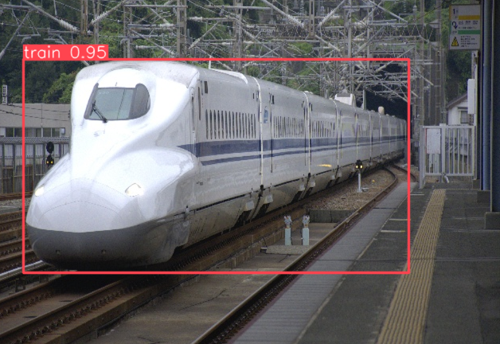
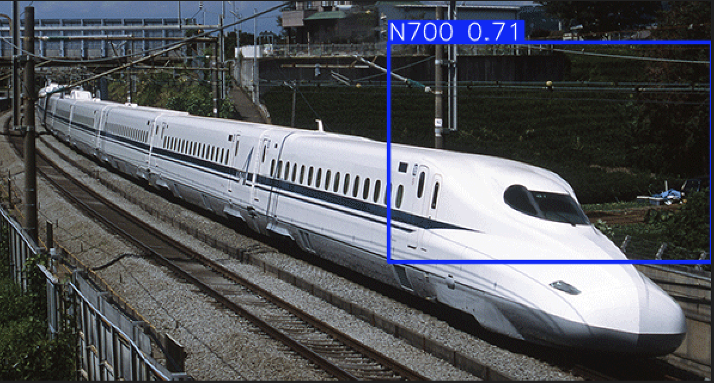

# Shinkansen Spotter

Learning project to utilize YOLO to detect train models from video or images. This will focus on the Shinkansen
or High-speed EMUs to limit training data set preparation.

Train pictures and model information have been obtained from Wikipedia at the following [URL](https://en.wikipedia.org/wiki/Shinkansen). Attribution for each of these images from Wikipedia can be found in the following file: [Attribution](attribution.csv).

The following Shinkansen models have been added to the dataset currently. 
- N700

Several overkill items have been added to simplify dataset preparation:
1. Training will begin automatically if no custom model has been trained (shinkansen.pt)
2. Any images in the raw/ folder will be resized using CV2 to resize to 640x640 and moved to their respective training folders (/N700/)
3. To add any new training data one just needs to add a folder for the respective train:
   1. For example (training-data/images/raw/E6)
   2. Those training folders and images will be auto labeled with YOLO to determine first if train
   3. Validation labels will need to be hand coded
4. Once those labels are generated, the folder they are in such as N700, etc. will be used to remap the YOLO labels
   1. N700 = 0
   2. E5 = 1
   3. E6 = 2
5. Training will begin on those defined labels 
6. Training for the model was performed on a Nvidia 5070 but a toggle exists to enable CPU training.

### Prerequisites
1. Install YOLO from ultralytics
```bash
conda install -c conda-forge ultralytics
```

2. Install CUDA Toolkit for GPU
```bash
pip3 install torch torchvision --index-url https://download.pytorch.org/whl/cu128
```

### Steps
1. Check help
```bash
python3 main.py -h
```

2. Check image for detection (image can be a local image or a url)
```bash
python3 main.py -i <IMAGE.png> 
```

3. Check video for detection (video can be local video or a URL)
```bash
python3 main.py -i <IMAGE.png> 
```

### Example Run
1. Run the script, this will run against a [test image](test-n700.png) without any arguments.
```bash
python main.py
```
1. Once run, the YOLO model will do a simpler pass on the dataset to generate the YOLO labels.
<p align="center">

</p>

2. After labels are generated (class_id 6) will be remapped to the desired classes (0,1,2), the model will be retrained on these labels.

4. Below is one resulting bounding box
<p align="center">

</p>

4. This is working on video currently but definitely warrants improvement
[POC Video](screenshots/poc_video.mp4)

### Todo
1. Clean up bounding boxes
2. Fix video flickering boxes when object is close
3. Add more train models
   1. E5
   2. E6